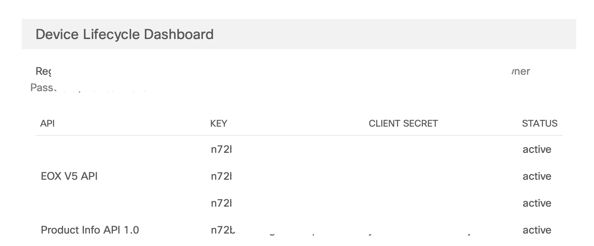

# GVE DevNet Product Lifecycle Analysis
It is important for customers to understand how the lifecycle of the products that they are acquiring. While this information is available on the Cisco website, it would be easier to generate a report on the key milestones in the lifecycle, e.g. Last Day of Support, End of Software Maintenance Release dates, etc. Based on the serial numbers, this app can generate a CSV file with product information and the key end of life milestones using the Cisco Support API. 

We can obtain the key end of life milestones in three steps:

1. First, we have to login to obtain an access token: 


2. Next, we upload a CSV file with the serial numbers. The CSV file is just one column with a serial number on each row:


3. After submitting the CSV file, the back-end will make calls to the Support API for each serial number and obtain the Product Info and EoX information. Then, a table will be generated with all the information:


4. Last, if you would like to download the information, then click on the button **Download CSV** to obtain a CSV file:


## Contacts
* Simon Fang (sifang@cisco.com)

## Solution Components
* Python 3.8
* Flask
* Cisco Support API

## Cisco Support API Key
The Cisco Support API allows customers and partners to programmatically access and consume Cisco Support data in the cloud. There are multiple Web Services part of the Cisco Support API. In this app, we focus specifically on the EoX and Product Info service. The former provides access to the Cisco EoX product data and the latter provides access to Cisco product information associated with device serial numbers or product IDs. 

> For more information about the Support API, please consult the documentation [here](https://developer.cisco.com/site/support-apis/)

In order to access the data, we have to register our application. Follow the following steps in order to obtain the credentials for your app:

1. Head over to the following url: https://apiconsole.cisco.com/apps/register. You will land on the following page after logging in:


2. Register your the name of your application, provide an application description and choose the Grant Type `Client Credentials`.

2. Tick the checkbox `EOX V5 API`


3. Tick the checkbox `Product Info API 1.0`


4. Agree to the Terms of Service and click `register`


5. Obtain the credentials from the page **My Apps & Keys**. You need to store these credentials in your .env file. The `CLIENT_ID` and `CLIENT_SECRET` from .env corresponds with the `KEY` and `CLIENT SECRET` respectively on this page.



Note: the keys and secrets on the screenshot have been obfuscated.

## Installation/Configuration

The following commands are executed in the terminal.

1. Create and activate a virtual environment for the project:
   
        #WINDOWS:
        $ py -3 -m venv [add_name_of_virtual_environment_here] 
        $ source [add_name_of_virtual_environment_here]/Scripts/activate
        #MAC:
        $ python3 -m venv [add_name_of_virtual_environment_here] 
        $ source [add_name_of_virtual_environment_here]/bin/activate
        
> For more information about virtual environments, please click [here](https://docs.python.org/3/tutorial/venv.html)

2. Access the created virtual environment folder

        $ cd [add_name_of_virtual_environment_here]

3. Clone this repository

        $ git clone [add_link_to_repository_here]

4. Access the folder `gve_devnet_product_lifecycle_analysis`

        $ cd gve_devnet_product_lifecycle_analysis

5. Install the dependencies:

        $ pip install -r requirements.txt

6. Open the `.env` file and add the environment variables. In the sections above, it is explained how to obtain these variables. Please note that all the variables below are strings.

    ```python
    CLIENT_ID = "<insert_client_id>"
    CLIENT_SECRET = "<insert_client_secret>"    
    ```

7. Last, you need to create a CSV file to upload in step 2. This CSV file is a single column with `serial_number` as the header and every subsequent row contains a serial number. An example:

    ```
    serial_number
    ABC123XYZ
    XYZ789CBA
    ...
    ```
An example CSV file, `example.csv`, has been added to the repository.

## Usage
Now it is time to launch the application! Simply type in the following command in your terminal:

    $ python app.py

Then, head over to the URL that is displayed in the terminal output. 


### LICENSE

Provided under Cisco Sample Code License, for details see [LICENSE](LICENSE.md)

### CODE_OF_CONDUCT

Our code of conduct is available [here](CODE_OF_CONDUCT.md)

### CONTRIBUTING

See our contributing guidelines [here](CONTRIBUTING.md)

#### DISCLAIMER:
<b>Please note:</b> This script is meant for demo purposes only. All tools/ scripts in this repo are released for use "AS IS" without any warranties of any kind, including, but not limited to their installation, use, or performance. Any use of these scripts and tools is at your own risk. There is no guarantee that they have been through thorough testing in a comparable environment and we are not responsible for any damage or data loss incurred with their use.
You are responsible for reviewing and testing any scripts you run thoroughly before use in any non-testing environment.